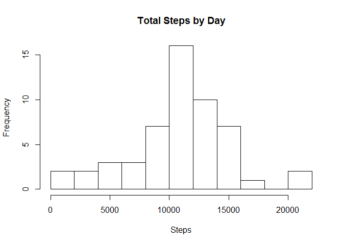
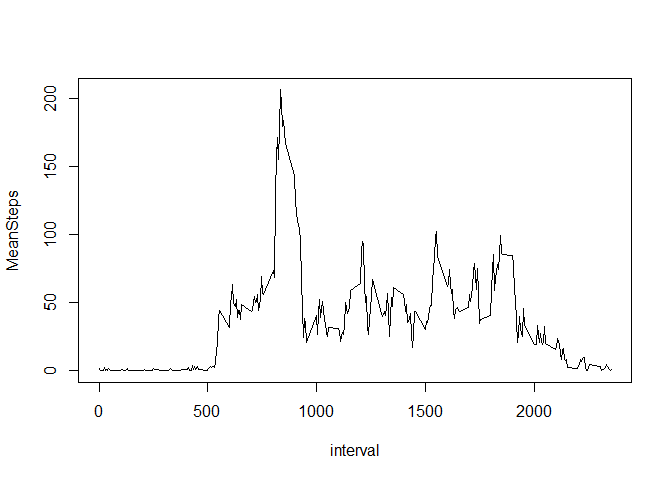
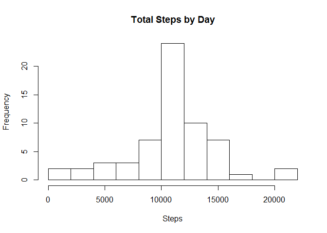
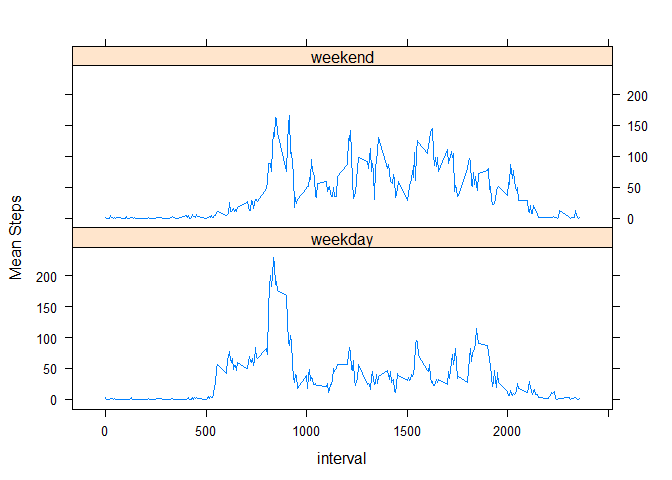

# Reproducible Research: Peer Assessment 1

## Loading and preprocessing the data


```r
library(data.table)
tbl <- read.csv("activity.csv")
tbl <- data.table(tbl)
```

## What is mean total number of steps taken per day?


```r
steps_per_day <- tbl[,list(Steps = sum(steps)), by=date]
summary(steps_per_day$Steps)
```

```
##    Min. 1st Qu.  Median    Mean 3rd Qu.    Max.    NA's 
##      41    8841   10760   10770   13290   21190       8
```

Here is how steps are distributed:


```r
hist(steps_per_day$Steps,
     breaks = 10,
     main = "Total Steps by Day",
     xlab = "Steps")
```

 

## What is the average daily activity pattern?

Let's find an interval with a maximum average steps:

```r
steps_by_interval <- tbl[,list(MeanSteps = mean(steps, na.rm = TRUE)), by = interval]
maxInt <- steps_by_interval[which.max(MeanSteps), ]
```

So, our maximum interval is **835** with **206** steps on average.

Now let's see the pattern:

```r
with(steps_by_interval, plot(x = interval, y = MeanSteps, type = "l"))
```

 

## Imputing missing values

Let's see how many NA's are there in our dataset:

```r
tbl[is.na(steps), .N]
```

```
## [1] 2304
```

Now let our strategy for filling missing values be simply taking means of each interval over all days. This should allow us to keep all important statistics almost unchanged by days and by individual intervals.


```r
tbl_filled <- copy(tbl)
setkey(steps_by_interval, interval)
setkey(tbl_filled, interval)
tbl_filled[steps_by_interval, Means := as.integer(round(MeanSteps))]
```

```
##        steps       date interval Means
##     1:    NA 2012-10-01        0     2
##     2:     0 2012-10-02        0     2
##     3:     0 2012-10-03        0     2
##     4:    47 2012-10-04        0     2
##     5:     0 2012-10-05        0     2
##    ---                                
## 17564:     0 2012-11-26     2355     1
## 17565:     0 2012-11-27     2355     1
## 17566:     0 2012-11-28     2355     1
## 17567:     0 2012-11-29     2355     1
## 17568:    NA 2012-11-30     2355     1
```

```r
tbl_filled[is.na(steps), steps := Means]
```

```
##        steps       date interval Means
##     1:     2 2012-10-01        0     2
##     2:     0 2012-10-02        0     2
##     3:     0 2012-10-03        0     2
##     4:    47 2012-10-04        0     2
##     5:     0 2012-10-05        0     2
##    ---                                
## 17564:     0 2012-11-26     2355     1
## 17565:     0 2012-11-27     2355     1
## 17566:     0 2012-11-28     2355     1
## 17567:     0 2012-11-29     2355     1
## 17568:     1 2012-11-30     2355     1
```

```r
tbl_filled[, Means := NULL]
```

```
##        steps       date interval
##     1:     2 2012-10-01        0
##     2:     0 2012-10-02        0
##     3:     0 2012-10-03        0
##     4:    47 2012-10-04        0
##     5:     0 2012-10-05        0
##    ---                          
## 17564:     0 2012-11-26     2355
## 17565:     0 2012-11-27     2355
## 17566:     0 2012-11-28     2355
## 17567:     0 2012-11-29     2355
## 17568:     1 2012-11-30     2355
```

```r
tbl_filled[is.na(steps), .N]
```

```
## [1] 0
```

Now let's look at the new statistics:


```r
steps_per_day_filled <- tbl_filled[,list(Steps = sum(steps)), by=date]
summary(steps_per_day_filled$Steps)
```

```
##    Min. 1st Qu.  Median    Mean 3rd Qu.    Max. 
##      41    9819   10760   10770   12810   21190
```

Here is our corrected distribution:


```r
hist(steps_per_day_filled$Steps,
     breaks = 10,
     main = "Total Steps by Day",
     xlab = "Steps")
```

 

We now see that the mean and the median are still the same, but our histogram now shows more days around mean value, while all other bars seem to remain unchanged. This kind of behavior is expected because we have generated more values close to means.

## Are there differences in activity patterns between weekdays and weekends?

Let's add a variable to identify weekdays:


```r
wkday <- weekdays(as.POSIXlt(tbl_filled$date), abbreviate = TRUE)
wkday <- wkday %in% c("Sat", "Sun")
wkday <- factor(ifelse(wkday, "weekend", "weekday"))
tbl_filled[,WD := wkday]
```

```
##        steps       date interval      WD
##     1:     2 2012-10-01        0 weekday
##     2:     0 2012-10-02        0 weekday
##     3:     0 2012-10-03        0 weekday
##     4:    47 2012-10-04        0 weekday
##     5:     0 2012-10-05        0 weekday
##    ---                                  
## 17564:     0 2012-11-26     2355 weekday
## 17565:     0 2012-11-27     2355 weekday
## 17566:     0 2012-11-28     2355 weekday
## 17567:     0 2012-11-29     2355 weekday
## 17568:     1 2012-11-30     2355 weekday
```

Now let's create a plot:


```r
library(lattice)
wkday_data <- tbl_filled[, list(Mean = mean(steps)), by=.(interval, WD)]
xyplot(Mean ~ interval | WD, data = wkday_data, panel = "panel.lines", layout = c(1, 2), ylab = "Mean Steps")
```

 
